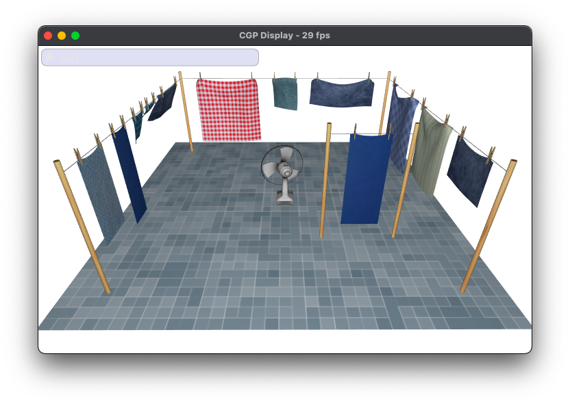

# Animation 3D

## About this project 

- CMake
- OpenGL

## Dependencies 

- Glad
- GLFW
- ImGUI 

## Build

```
cd projet/
cmake -S . -B build
cmake --build build
```

## Run

```
./build/projet
```


## Usage 

### Controls

- Rotation: left clic + mouse displacement
- Get close/away from the center: right clic + vertical mouse displacement
- Panning (= translation in view plane): CTRL + left clic + mouse displacement
- Move forward/backward (= translation in orthogonal view plane): CTRL + right droit + vertical mouse displacement

### TODO 

- Collisions between the cloth and itself
- Collisions between the cloth and the thread of the clothesline
